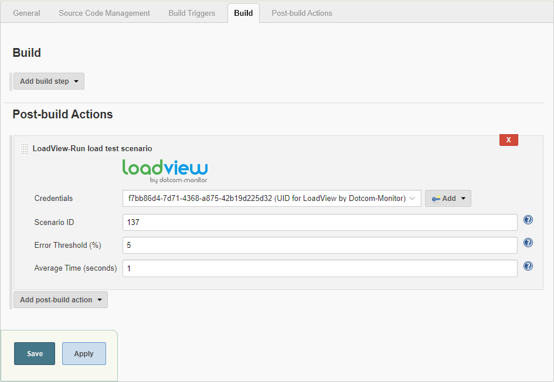
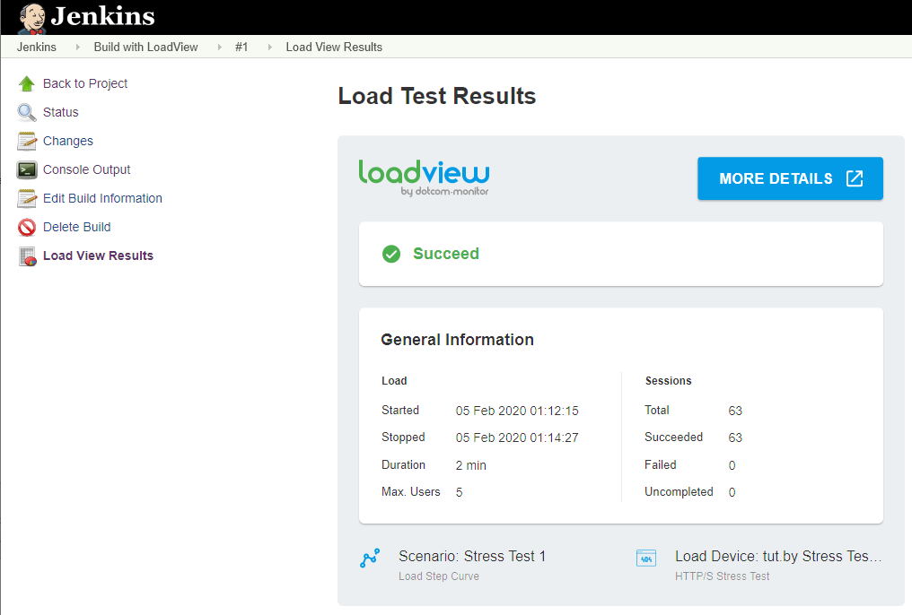

# LoadView Stress Testing Plugin by Dotcom-Monitor
## Summary
LoadView allows to load test Websites, Web Application, and API with thousands of concurrent users using basic HTTP protocol or Full Real Browsers from a managed cloud. Such testing verifies that there we no performance degradations between builds and code changes and that your application can handle concurrent load. Plugin allows you to setup load test as a Jenkins build Action.
## Features
* Real user behavior simulations (browsing, searching, adding products to a shopping cart, etc.).
* Support for over 40 desktop/mobile browsers and devices.
* Supports RESTful APIs, such as JSON and XML, as well as SOAP and Web APIs that require authentication or multi-step execution.
* Load injector servers from 18 zones around the world including the United States, Canada, South America, Europe, and APAC.
* Whitelisting of Fixed IPs 
## Configuring Plugin
1. Login to the Dotcom-Monitor LoadView account.
2. In LoadView, create your LoadView UID under **Account > Integrations > Add Integration > Stress Testing Web API**. Copy the integration UID.

3. Login to your Jenkins account.
4. In Jenkins, go to **Credentials > Add Credentials > LoadView Security Token (UID)**.
5. Configure and validate the credentials:
	* **Scope:** select **Global**.
	* **ID:** leave default or specify a unique ID.
	* **Description:** specify a unique description to distinguish the credentials.
	* **UID:** paste LoadView UID.

6. In Jenkins, select a job and click Configure.
7. Go to **Build > Post-build Actions > Add post-build action > LoadView-Run load test scenario**.
8. Specify LoadView Stress Test settings for the build:
	* **Credentials:** select the API key using the description.
	* **Scenario ID:** paste the stress test scenario ID you want to use in the build. Copy the ID from the scenario page in LoadView.
	* **Error Threshold:** specify an acceptable percentage of sessions with errors that occurred while testing (failed to access the target resource, no keywords/image found, etc.). If the percentage of error sessions is greater than the specified value, the build will be marked as a *failure* in Jenkins.
	* **Average Time:** specify a limit for an average response time measured while test execution. If the limit is reached, the build will be marked as a *failure* in Jenkins.

9. Click **Save**.
## View Test Results
When a stress test is running the status of execution is displayed in the Jenkins **Console Output** in real-time mode.

When the test is finished, the results can be found under **LoadView Results** in the build menu. To review LoadView comprehensive reports on the test execution results, click **More Details**.

