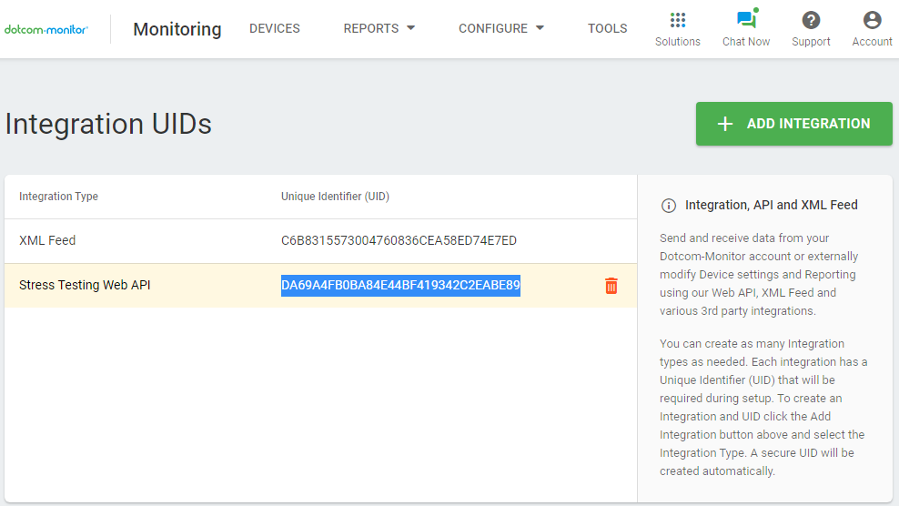

# LoadView Stress Testing Plugin by Dotcom-Monitor
## Summary
LoadView allows to load test Websites, Web Application, and API with thousands of concurrent users using basic HTTP protocol or Full Real Browsers from a managed cloud. Such testing verifies that there we no performance degradations between builds and code changes and that your application can handle concurrent load. Plugin allows you to setup load test as a Jenkins build Action.
## Features
* Real user behavior simulations (browsing, searching, adding products to a shopping cart, etc.).
* Support for over 40 desktop/mobile browsers and devices.
* Supports RESTful APIs, such as JSON and XML, as well as SOAP and Web APIs that require authentication or multi-step execution.
* Load injector servers from 18 zones around the world including the United States, Canada, South America, Europe, and APAC.
* Whitelisting of Fixed IPs 
## Install Plugin
1. Login to the Dotcom-Monitor LoadView account.
2. In LoadView, create your LoadView UID under Account > Integrations > Add Integration > Stress Testing Web API. Copy the integration UID.

3. Login to your Jenkins account.
4. In Jenkins, go to Credentials > Add Credentials > LoadView Security Token (UID).
5. Configure and validate the credentials:
	* Scope: select Global.
	* ID: leave default or specify a unique ID.
	* Description: specify a unique description to distinguish the credentials.
	* UID: paste LoadView UID.

